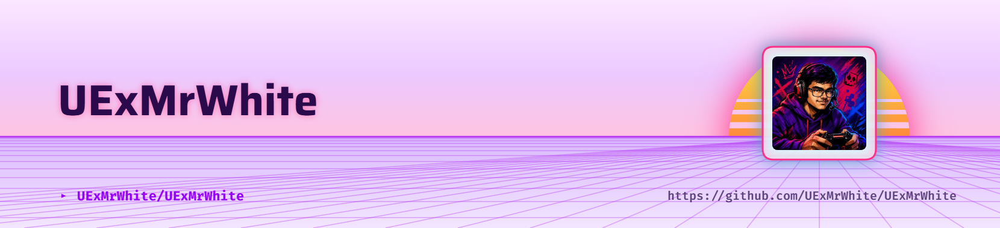

  <picture>
    <source media="(prefers-color-scheme: dark)" srcset="./header-dark.png">
    
  </picture>

 

# Hey there, I'm UExMrWhite 👋

  

&nbsp;

&nbsp;

  

---

## 🚀 About Me

<table>
<tr>
<td width="65%" valign="middle">

### Hi, I'm UExMrWhite! 👋

I'm a **Developer** passionate about **Applications, Technology, and Gaming**.

- 🔭 Currently working on **Material Game Launcher**
- 🌱 Currently learning **Everything**
- 💡 Interested in **Technology**
- 🛠️ Building with **Love :)**
- 🎮 Gamer at heart
- 📍 Based in **Sri Lanka**

 

I enjoy turning ideas into real projects, experimenting with new technologies, and continuously improving my skills.

 

</td>

<td width="35%" align="center" valign="middle">

  

 

 

</td>
</tr>
</table>

---

## 🧰 Tech Stack

### Languages

  

### Frameworks & Libraries

  

### Tools & Platforms

  

### Game Development

---

## 📊 GitHub Analytics

 

 

---

## 🐍 Contribution Snake

---

## 💻 Featured Projects

---

## 🌐 Connect With Me

&nbsp;

&nbsp;

&nbsp;

---

<i>"Building ideas with code, one project at a time."</i>

  

 

<picture>
  <source media="(prefers-color-scheme: dark)" srcset="https://capsule-render.vercel.app/api?type=waving&height=160&section=footer&color=0:0D1117,50:6D28D9,100:A855F7&animation=twinkling">
  <source media="(prefers-color-scheme: light)" srcset="https://capsule-render.vercel.app/api?type=waving&height=160&section=footer&color=0:111827,50:7C3AED,100:C084FC&animation=twinkling">
  
</picture>

